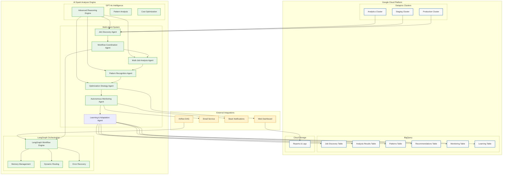
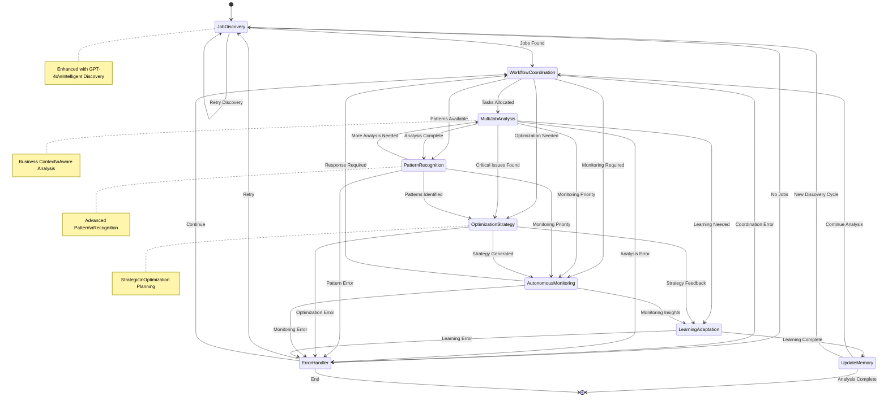
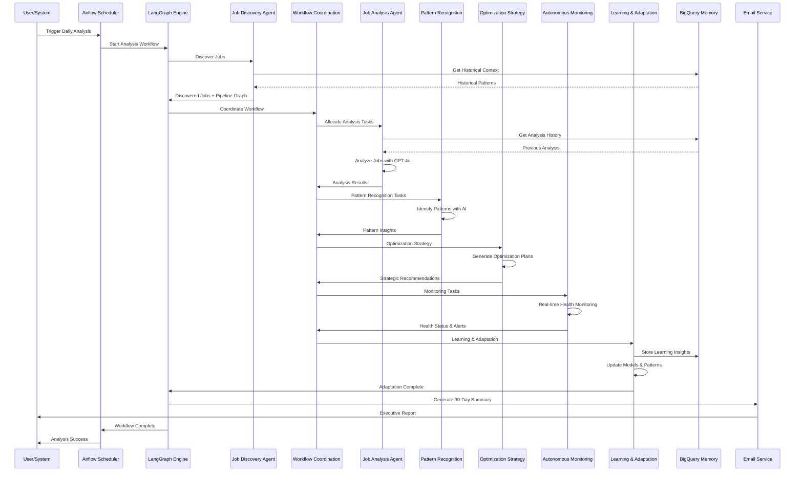
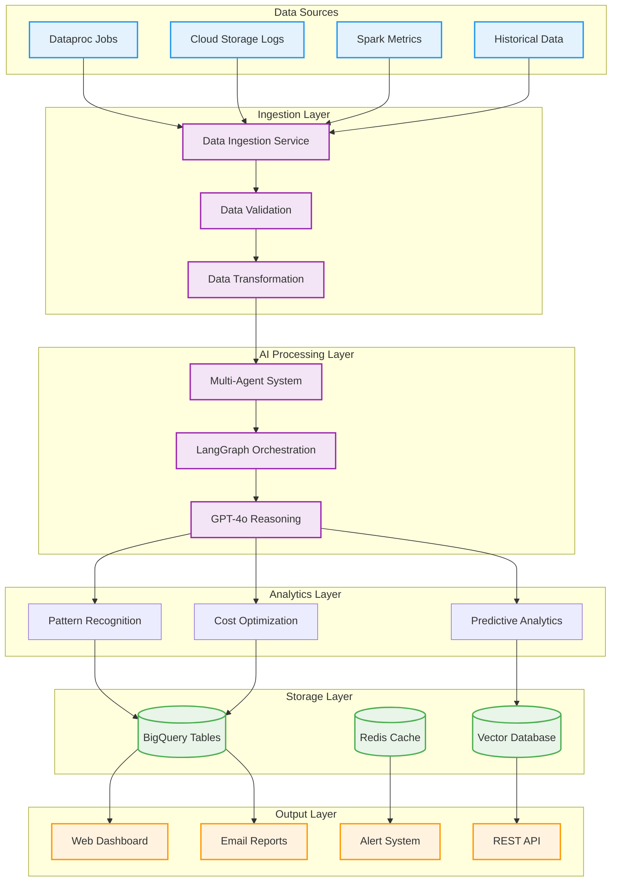
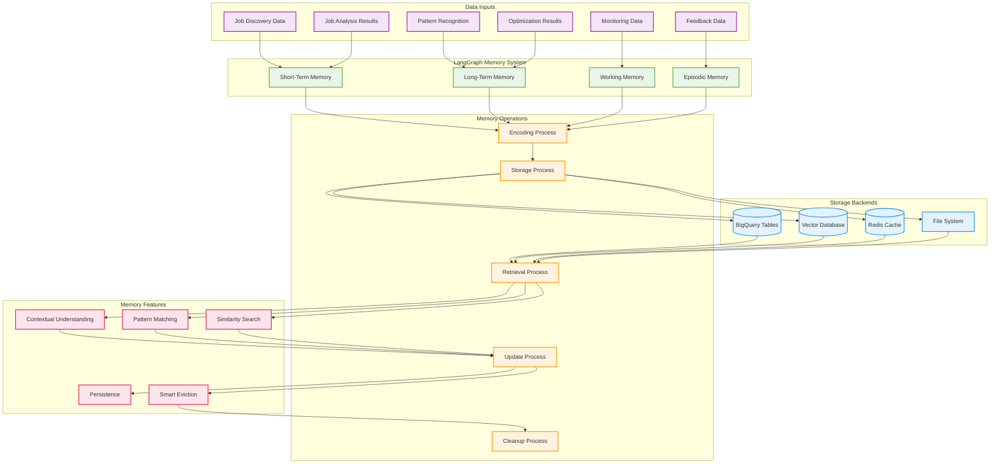
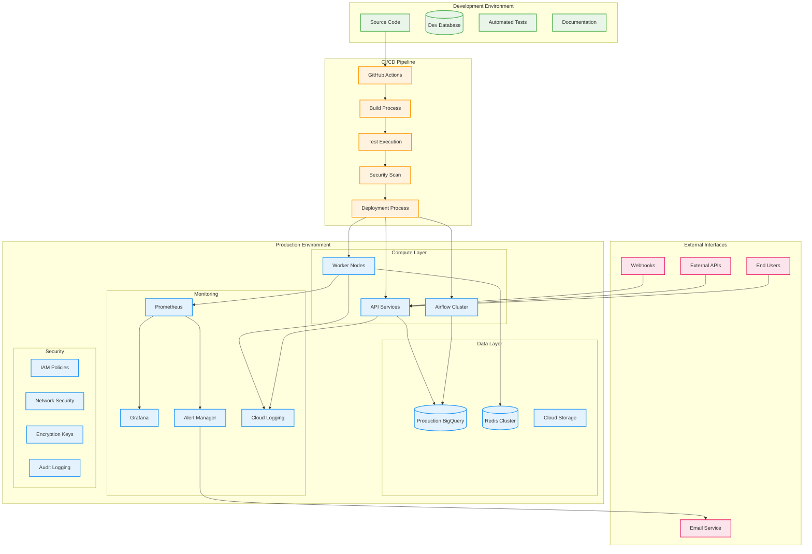

# AI Spark Analyzer - Architecture Diagrams

## System Architecture Overview

## LangGraph Workflow State Machine

## Multi-Agent Interaction Flow

## Data Flow Architecture

## Cost Optimization Pipeline

```mermaid
graph LR
    subgraph "Input Data"
        JOB_DATA[Spark Job Data]
        USAGE[Resource Usage]
        COSTS[Current Costs]
        HISTORY[Historical Patterns]
    end

    subgraph "Analysis Engine"
        COLLECT[Data Collection]
        ANALYZE[Cost Analysis]
        IDENTIFY[Opportunity Identification]
        PRIORITIZE[Impact Prioritization]
    end

    subgraph "AI Recommendations"
        GPT4O[GPT-4o Analysis]
        STRATEGY[Optimization Strategy]
        PREDICTION[ROI Prediction]
        RISK[Risk Assessment]
    end

    subgraph "Optimization Categories"
        RESOURCE[Resource Rightsizing]
        SCHEDULING[Job Scheduling]
        CONFIG[Configuration Tuning]
        CODE[Code Optimization]
        SPOT[Spot Instance Usage]
        AUTOSCALING[Auto Scaling]
    end

    subgraph "Implementation"
        PLAN[Implementation Plan]
        AUTOMATE[Automation Scripts]
        MONITOR[Monitoring Setup]
        VALIDATE[Validation]
    end

    subgraph "Outcomes"
        SAVINGS[Cost Savings]
        PERFORMANCE[Performance Gains]
        EFFICIENCY[Efficiency Improvement]
        REPORTING[ROI Reporting]
    end

    %% Connections
    JOB_DATA --> COLLECT
    USAGE --> COLLECT
    COSTS --> COLLECT
    HISTORY --> COLLECT

    COLLECT --> ANALYZE
    ANALYZE --> IDENTIFY
    IDENTIFY --> PRIORITIZE

    PRIORITIZE --> GPT4O
    GPT4O --> STRATEGY
    STRATEGY --> PREDICTION
    PREDICTION --> RISK

    RISK --> RESOURCE
    RISK --> SCHEDULING
    RISK --> CONFIG
    RISK --> CODE
    RISK --> SPOT
    RISK --> AUTOSCALING

    RESOURCE --> PLAN
    SCHEDULING --> PLAN
    CONFIG --> PLAN
    CODE --> PLAN
    SPOT --> PLAN
    AUTOSCALING --> PLAN

    PLAN --> AUTOMATE
    AUTOMATE --> MONITOR
    MONITOR --> VALIDATE

    VALIDATE --> SAVINGS
    VALIDATE --> PERFORMANCE
    VALIDATE --> EFFICIENCY
    VALIDATE --> REPORTING

    classDef input fill:#e1f5fe,stroke:#0288d1,stroke-width:2px
    classDef analysis fill:#f1f8e9,stroke:#689f38,stroke-width:2px
    classDef ai fill:#fce4ec,stroke:#c2185b,stroke-width:2px
    classDef optimization fill:#fff8e1,stroke:#ffa000,stroke-width:2px
    classDef implementation fill:#e8eaf6,stroke:#3f51b5,stroke-width:2px
    classDef outcome fill:#e0f2f1,stroke:#009688,stroke-width:2px

    class JOB_DATA,USAGE,COSTS,HISTORY input
    class COLLECT,ANALYZE,IDENTIFY,PRIORITIZE analysis
    class GPT4O,STRATEGY,PREDICTION,RISK ai
    class RESOURCE,SCHEDULING,CONFIG,CODE,SPOT,AUTOSCALING optimization
    class PLAN,AUTOMATE,MONITOR,VALIDATE implementation
    class SAVINGS,PERFORMANCE,EFFICIENCY,REPORTING outcome
```

## Memory Management Architecture

## Deployment Architecture

## Security Architecture

```mermaid
graph TB
    subgraph "Authentication & Authorization"
        OAUTH[OAuth 2.0 / OIDC]
        RBAC[Role-Based Access Control]
        JWT[JWT Tokens]
        MFA[Multi-Factor Authentication]
    end

    subgraph "Data Protection"
        ENCRYPTION_AT_REST[Encryption at Rest]
        ENCRYPTION_IN_TRANSIT[Encryption in Transit]
        KEY_MANAGEMENT[Key Management Service]
        DATA_MASKING[Data Masking]
    end

    subgraph "Network Security"
        VPC[Virtual Private Cloud]
        FIREWALL[Firewall Rules]
        PRIVATE_ENDPOINTS[Private Endpoints]
        DDoS[DDoS Protection]
    end

    subgraph "Application Security"
        INPUT_VALIDATION[Input Validation]
        OUTPUT_ENCODING[Output Encoding]
        DEPENDENCY_SCANNING[Dependency Scanning]
        SECRET_MANAGEMENT[Secret Management]
    end

    subgraph "Monitoring & Auditing"
        AUDIT_LOGS[Audit Logs]
        SECURITY_MONITORING[Security Monitoring]
        INCIDENT_RESPONSE[Incident Response]
        COMPLIANCE[Compliance Reporting]
    end

    subgraph "Compliance Standards"
        GDPR[GDPR]
        SOC2[SOC 2]
        HIPAA[HIPAA]
        ISO27001[ISO 27001]
    end

    %% Connections
    OAUTH --> RBAC
    RBAC --> JWT
    JWT --> MFA

    ENCRYPTION_AT_REST --> KEY_MANAGEMENT
    ENCRYPTION_IN_TRANSIT --> KEY_MANAGEMENT
    KEY_MANAGEMENT --> DATA_MASKING

    VPC --> FIREWALL
    FIREWALL --> PRIVATE_ENDPOINTS
    PRIVATE_ENDPOINTS --> DDoS

    INPUT_VALIDATION --> OUTPUT_ENCODING
    OUTPUT_ENCODING --> DEPENDENCY_SCANNING
    DEPENDENCY_SCANNING --> SECRET_MANAGEMENT

    AUDIT_LOGS --> SECURITY_MONITORING
    SECURITY_MONITORING --> INCIDENT_RESPONSE
    INCIDENT_RESPONSE --> COMPLIANCE

    COMPLIANCE --> GDPR
    COMPLIANCE --> SOC2
    COMPLIANCE --> HIPAA
    COMPLIANCE --> ISO27001

    classDef auth fill:#e3f2fd,stroke:#2196f3,stroke-width:2px
    classDef data fill:#e8f5e8,stroke:#4caf50,stroke-width:2px
    classDef network fill:#fff3e0,stroke:#ff9800,stroke-width:2px
    classDef app fill:#f3e5f5,stroke:#9c27b0,stroke-width:2px
    classDef monitor fill:#fce4ec,stroke:#e91e63,stroke-width:2px
    classDef compliance fill:#e0f2f1,stroke:#009688,stroke-width:2px

    class OAUTH,RBAC,JWT,MFA auth
    class ENCRYPTION_AT_REST,ENCRYPTION_IN_TRANSIT,KEY_MANAGEMENT,DATA_MASKING data
    class VPC,FIREWALL,PRIVATE_ENDPOINTS,DDoS network
    class INPUT_VALIDATION,OUTPUT_ENCODING,DEPENDENCY_SCANNING,SECRET_MANAGEMENT app
    class AUDIT_LOGS,SECURITY_MONITORING,INCIDENT_RESPONSE,COMPLIANCE monitor
    class GDPR,SOC2,HIPAA,ISO27001 compliance
```

